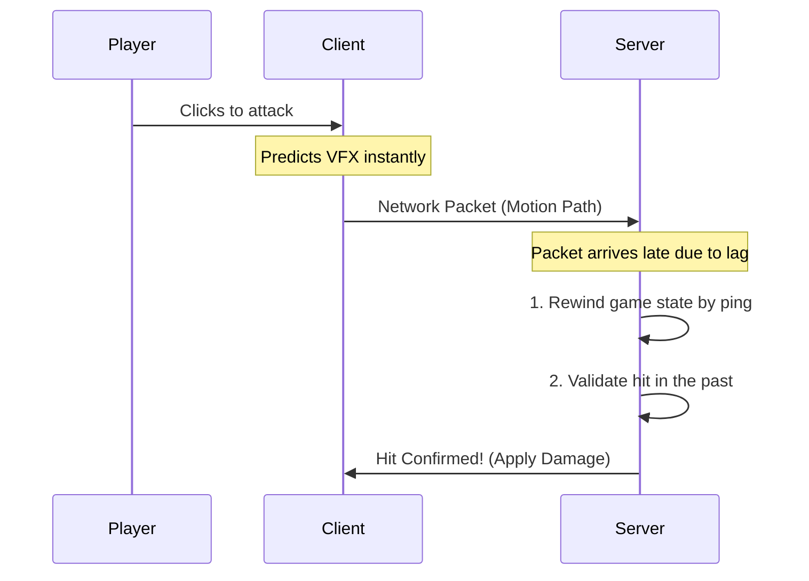

# Roblox Combat Framework

This is a strictly server-authoritative, client-predicted combat framework for Roblox. 

## Core Architecture

Client-predicted melee combat requires two components:
1. Instant visual feedback for the client.
2. Strict server-side validation to prevent exploitation.

This framework solves both using **Rollback Lag Compensation**. 

## Anti-Cheat
Client prediction usually opens the door for exploiters, but this framework enforces strict server-side bounds:
- **Max Rewind Depth (1.5s):** The server only keeps a 1.5-second history buffer. If a lag-switcher freezes their internet and tries to send a packet 5 seconds later, the server drops it.
- **Latency Tolerance (6 studs):** The server checks where the attacker *claims* to have swung from against where the server thinks they actually are. If they teleported across the map to land a hit, it's rejected.
- **Sequence Validation:** Every swing has an incrementing ID. Replay attacks (duplicating a hit packet to deal double damage) are automatically dropped.
- **Future Rejection:** Any packet claiming to originate from a timestamp in the future is immediately dropped. 

## Technical Details
The server pulls historical CFrames from a 60hz Rewind Buffer and uses a pure-Lua 15-axis Separating Axis Theorem (SAT) to mathematically calculate Oriented-Bounding-Box overlap 
Fast melee swings travel in an arc. 
Hit results and debug adornments use a strict `Pool.luau`, preventing GC lag spikes.
Projectiles are manually ticked by the server using shape-casting.

## Architecture Quirks
Characters must be parented to `workspace.Alive`
**`Combatant.Health` vs `Humanoid.Health`: Noted in GettingStarted
`DefaultMovesetId` on the client must match the server.

## Documentation & Setup
Full setup instructions, configuration details, and the complete API reference are located in the `src/server/Docs/` directory:
- **`GettingStarted.luau`**: Step-by-step tutorial for rigging your first combatant and skill.
- **`APIReference.luau`**: Exhaustive list of all methods, signals, and hooks.
- **`ImportantMisc.luau`**: Advanced mechanics like lag simulation, blocking, and the Server/Shared configuration split.

## API Quick Reference

### Registries & Setup
| Function | Description |
| :--- | :--- |
| `CombatantRegistry.Create(model, def, player)` | Wraps a Model in a `Combatant` wrapper, granting Health, Mana, and Stamina. |
| `CombatantRegistry.Get(model)` | Returns the active `Combatant` object for a given model. |
| `CombatantRegistry.Destroy(model)` | Cleans up the Combatant and removes it from the rewind buffer. |
| `CombatantSkills.Equip(model, skillId)` | Equips a registered skill to the Combatant. |

### Combatant Methods & Events
| Event / Method | Description |
| :--- | :--- |
| `Combatant.OnDamaged(amount, type, source)` | Fired when damaged. |
| `Combatant.OnHealed(amount, source)` | Fired when health is restored. |
| `Combatant.OnDied(source)` | Fired when Health hits 0. |
| `Combatant:ApplyDamage(amount, type, source)` | Forces damage onto the combatant (Server only). |
| `Combatant:Heal(amount)` | Restores health up to the configured MaxHealth. |
| `Combatant:GetResource(id)` | Returns current value of a resource (e.g. "Stamina", "Mana"). |
| `Combatant:SpendResource(id, amount)` | Consumes a resource. Rejects if insufficient. |
| `Combatant:ApplyStatusEffect(effect)` | Applies an immutable `StatusEffect` definition (like Burning or Stun) which automatically handles ticking and duration. |
| `Combatant:HasStatusEffect(effectName)` | Returns boolean if the target currently suffers from this effect. |

## Installation & Tests
Run `rojo build test.project.json -o test.rbxlx`. Open in Studio to view tests.
