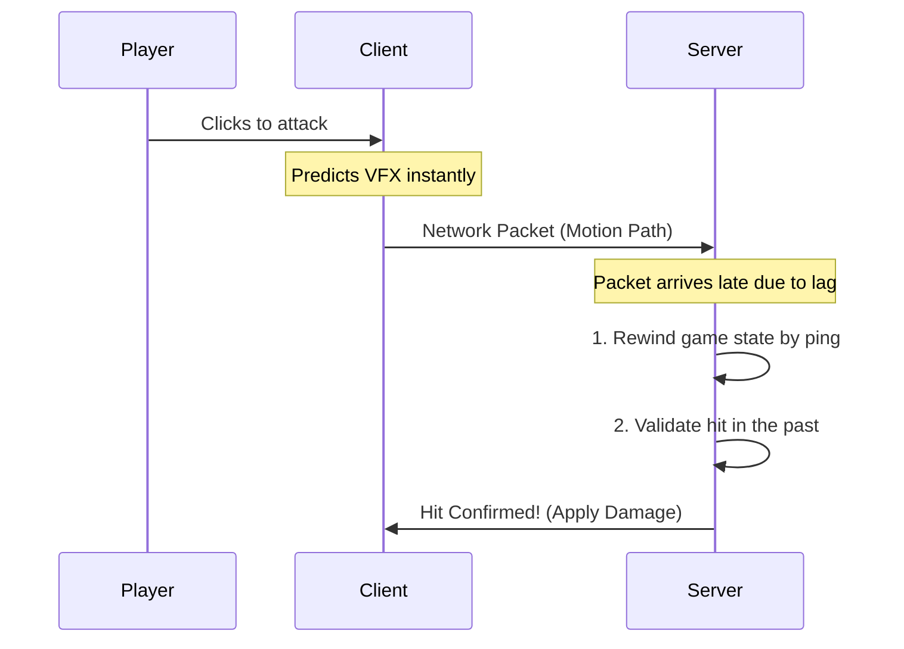

# rickopath-combat

Server-authoritative combat framework with rollback lag compensation. Built with Rojo and Wally.

## Features

- Rollback hitboxes using SAT collision against a 60hz rewind buffer
- Arc sub-stepping on melee swings
- Deterministic server-ticked projectiles
- Object pooling on hit results
- Anti-cheat: rewind capped at 1.5s, future timestamps dropped, replay attacks blocked
- Skill and moveset system with input binding, cooldowns, and resource costs (mana, stamina)
- Status effects: damage-over-time, stuns, debuffs. Supports stacking and refresh rules
- Client-side VFX hooks with Studio attribute controls for emit count, lifetime, and part attachment

## Notes

> **`workspace.Alive`**: Characters and NPCs must be parented here to be tracked.

> **Health**: `Humanoid.Health` is ignored by default. Set `MirrorHealthToHumanoid = true` in `ServerConfig.luau` if you need the health bar to reflect actual health.

> **Movesets**: `DefaultMovesetId` must match on both client and server.

## Installation

### RBXM (No Rojo)
1. Drag the `.rbxm` from GitHub Releases into Studio. It imports as a folder named `RickopathCombat`.
2. Move `Shared` and `Packages` into `ReplicatedStorage`.
3. Move `Server` into `ServerScriptService`.
4. Move `Client` into `StarterPlayerScripts`.
5. Delete the now-empty `RickopathCombat` folder.

### Rojo & Wally
1. Install [Aftman](https://github.com/LPGhatguy/aftman) or [Rokit](https://github.com/rojo-rbx/rokit).
2. Run `aftman install` to get Wally and Rojo.
3. Run `wally install` to pull dependencies.
4. Run `rojo serve` and connect via the Studio plugin.

To build: `rojo build model.project.json -o RickopathCombat.rbxm`  
To run tests: `rojo build test.project.json -o test.rbxlx`

## Docs

Setup and API docs are in `src/server/Docs/`:

- `GettingStarted.luau` — step-by-step setup
- `APIReference.luau` — full method and signal list
- `ImportantMisc.luau` — advanced stuff (blocking, config, lag testing)

## API

| Method / Event | Description |
| --- | --- |
| `CombatantRegistry.Create(model, def, player)` | Registers a model as a combatant. |
| `CombatantRegistry.Get(model)` | Returns the combatant for a model. |
| `CombatantRegistry.Destroy(model)` | Removes the combatant and clears its rewind buffer. |
| `Combatant.OnDamaged(amount, type, source)` | Fires when damaged. |
| `Combatant.OnHealed(amount, source)` | Fires when healed. |
| `Combatant.OnDied(source)` | Fires when health hits 0. |
| `Combatant:ApplyDamage(amount, type, source)` | Server only. |
| `Combatant:Heal(amount)` | Heals up to MaxHealth. |
| `Combatant:GetResource(id)` | Returns a resource pool (e.g. "Stamina"). |
| `Combatant:SpendResource(id, amount)` | Fails if insufficient. |
| `Combatant:ApplyStatusEffect(effect)` | Applies a status effect definition. |
| `Combatant:HasStatusEffect(id)` | Returns true if the effect is active. |