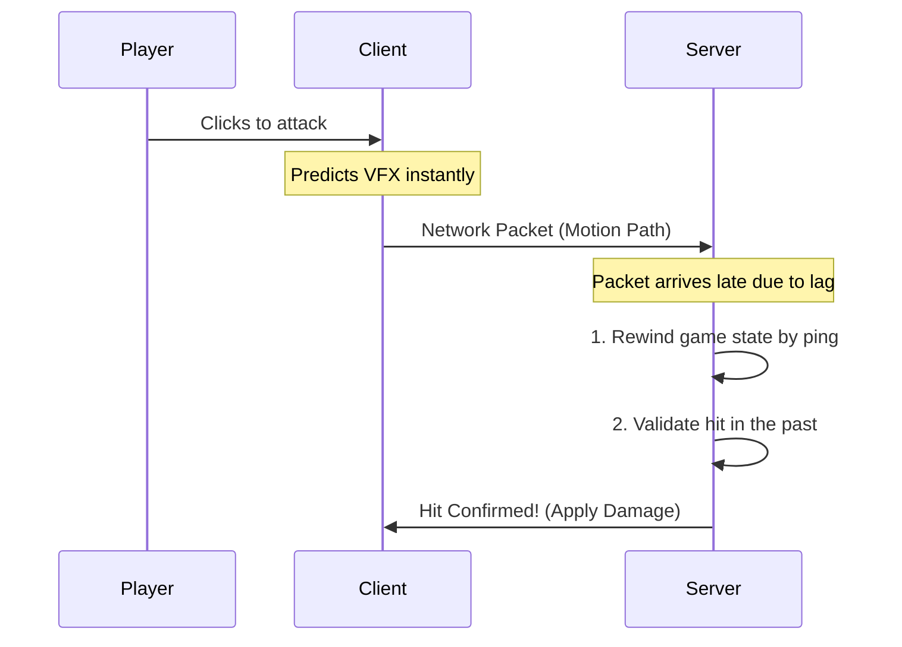

# rickopath-combat

A strictly server-authoritative, client-predicted combat framework for Roblox.

## Core Architecture

This framework uses rollback lag compensation to handle client prediction. It provides instant visual feedback on the client while maintaining authoritative hit validation on the server.

## Anti-Cheat Validation

To secure client prediction, the server enforces these bounds:

* **Max Rewind Depth (1.5s):** The server maintains a 1.5-second history buffer. Packets older than this are dropped to mitigate lag-switching.
* **Latency Tolerance (6 studs):** The server verifies the attacker's claimed hit position against their actual server-tracked position.
* **Sequence Validation:** Every swing uses an incrementing ID. Replayed or duplicated hit packets are ignored.
* **Future Rejection:** Packets claiming to originate from a future timestamp are dropped.

## Technical Details

* **Hit Detection:** Uses a pure-Luau 15-axis Separating Axis Theorem (SAT) to calculate Oriented-Bounding-Box overlap against historical CFrames pulled from a 60hz server rewind buffer.
* **Arc Sub-stepping:** Melee swing arcs are sliced into smaller steps based on angular distance to prevent hits from skipping past targets.
* **Memory Management:** Hit results and debug adornments utilize `Pool.luau` to prevent garbage collection spikes.
* **Projectiles:** Projectiles are ticked strictly on the server using shape-casting to prevent clipping through geometry.

## Architecture Quirks

1. **`workspace.Alive` Rule:** Characters must be parented to `workspace.Alive` 
2. **Health Authority:** The framework manages an internal, authoritative health pool that forces syncs to `Humanoid.Health`.
3. **Moveset Parity:** The `DefaultMovesetId` on the client must exactly match the server.

## Installation

### Option 1: RBXM Download (For Non-Rojo Users)
If you downloaded the `.rbxm` model file from GitHub Releases:
1. Drag the `.rbxm` file into your Roblox Studio viewport. It will import as a single Folder named `RickopathCombat`.
2. **CRITICAL:** You must manually unpack this folder, or the framework will crash.
3. Move the `Shared` and `Packages` folders into `ReplicatedStorage`.
4. Move the `Server` folder into `ServerScriptService`.
5. Move the `Client` folder into `StarterPlayerScripts`.
6. Delete the now-empty `RickopathCombat` folder.

### Option 2: Rojo & Wally (For Version Control)
This framework relies on Wally for package management and Rojo for Studio syncing.
1. Ensure your toolchain manager is installed ([Aftman](https://github.com/LPGhatguy/aftman) or [Rokit](https://github.com/rojo-rbx/rokit)).
2. Run `aftman install` (or `rokit install`) to provision Wally and Rojo.
3. Run `wally install` to fetch dependencies and generate the `Packages` directory.
4. Build or sync the project:
* **To sync live:** Run `rojo serve` and connect via the Roblox Studio plugin.
* **To build a flat model:** Run `rojo build model.project.json -o RickopathCombat.rbxm`.
* **To run the test suite:** Run `rojo build test.project.json -o test.rbxlx` and open the file in Studio.

## Documentation & Setup

Complete setup instructions and the API reference are located in `src/server/Docs/`:

* **`GettingStarted.luau`**: Setup guide for rigging combatants and skills.
* **`APIReference.luau`**: Method, signal, and hook documentation.
* **`ImportantMisc.luau`**: Mechanics covering lag simulation, blocking, and configuration.

## API Quick Reference

### Registries & Setup

| Function | Description |
| --- | --- |
| `CombatantRegistry.Create(model, def, player)` | Wraps a Model in a `Combatant` wrapper, granting Health, Mana, and Stamina. |
| `CombatantRegistry.Get(model)` | Returns the active `Combatant` object for a given model. |
| `CombatantRegistry.Destroy(model)` | Cleans up the Combatant and removes it from the rewind buffer. |
| `CombatantSkills.Equip(model, skillId)` | Equips a registered skill to the Combatant. |

### Combatant Methods & Events

| Event / Method | Description |
| --- | --- |
| `Combatant.OnDamaged(amount, type, source)` | Fired when damaged. |
| `Combatant.OnHealed(amount, source)` | Fired when health is restored. |
| `Combatant.OnDied(source)` | Fired when Health hits 0. |
| `Combatant:ApplyDamage(amount, type, source)` | Forces damage onto the combatant (Server only). |
| `Combatant:Heal(amount)` | Restores health up to the configured MaxHealth. |
| `Combatant:GetResource(id)` | Returns the current value of a specific resource. |
| `Combatant:SpendResource(id, amount)` | Consumes a resource. Fails if the current value is insufficient. |
| `Combatant:ApplyStatusEffect(effect)` | Applies a `StatusEffect` definition (e.g., Burning, Stun) and handles its internal tick and duration. |
| `Combatant:HasStatusEffect(effectName)` | Returns a boolean indicating if the target is currently under the specified effect. |